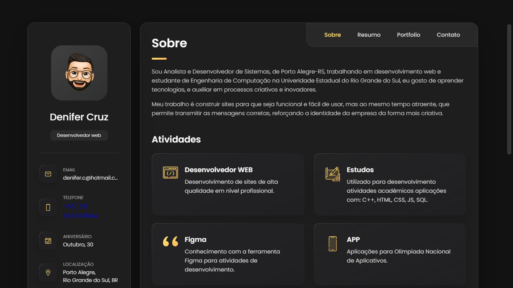

<h1 align="center"> Portifólio </h1>

Esse porfitólio foi realizado com o intuito de desenvolver habilidaes a cerca da tecnologia WEB.  

  <a href="#-tecnologias">Tecnologias</a>&nbsp;&nbsp;&nbsp;|&nbsp;&nbsp;&nbsp;
  <a href="#-projeto">Projeto</a>&nbsp;&nbsp;&nbsp;|&nbsp;&nbsp;&nbsp;
  <a href="#-layout">Layout</a>&nbsp;&nbsp;&nbsp;|&nbsp;&nbsp;&nbsp;
  <a href="#memo-licença">Licença</a>

  

 

  

## 🚀 Tecnologias

Esse projeto foi desenvolvido com as seguintes tecnologias:

- HTML e CSS
- JavaScript
- Git e Github
- Figma

## 💻 Projeto

O Portifólio permite visulaizar projetos e dados do desenvolvedor.

- [Visite o projeto online](https://denifercruz.github.io/Portifolio/)

## 🔖 Layout

## :memo: Licença

Esse projeto está sob a licença MIT.

---
